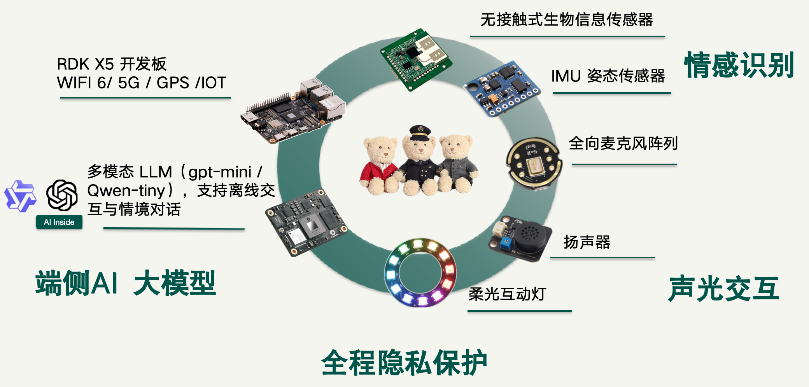
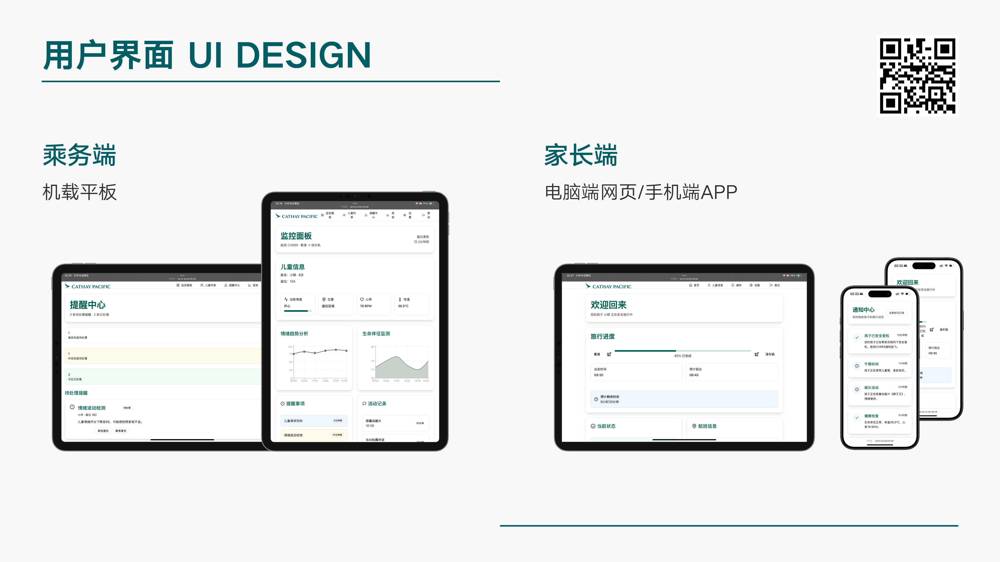
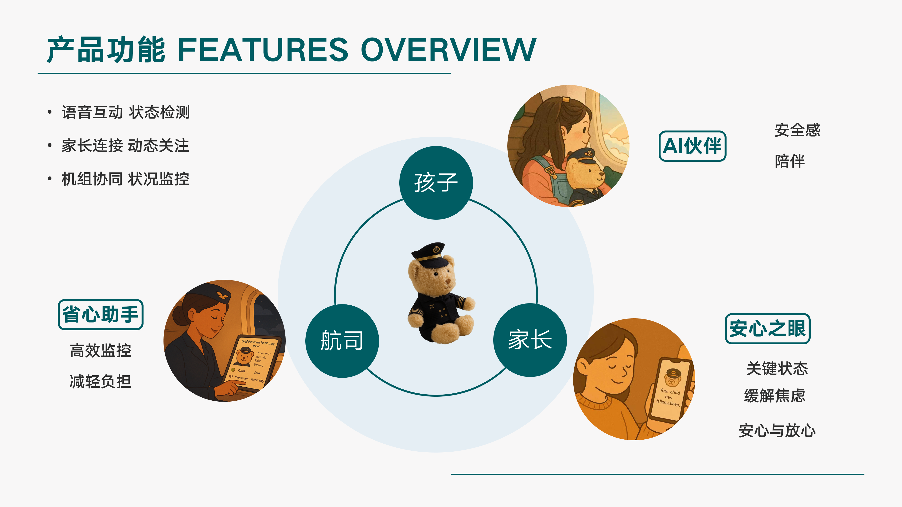

# Captain Milo - Intelligent Teddy Bear Companion System

**Project Website**: https://captain-milo-ai-companion-for-kids-on-flights-118574819172.us-west1.run.app/

[English](#english) | [中文](README_CN.md)

---

<a name="english"></a>

## Project Overview

**Captain Milo** is an intelligent teddy bear companion system developed by the **E094 Team at Cathay Hackathon**, specifically designed for unaccompanied minor passengers. Built on ESP32 and RDK platforms, it integrates ASR (Automatic Speech Recognition), LLM (Large Language Models), TTS (Text-to-Speech), IoT, and Web technologies to provide companionship, guidance, and safety protection for young travelers flying independently through voice interaction. It also features a web display interface for convenient UM child management and parent interaction experience.

> **Current Version Note**: The current demo is an **online cloud-based model inference version** with real-time cloud API integration. The offline model inference modules are RDK-Offline-ASR, RDK-Offline-LLM, and RDK-Offline-TTS.





## Key Features

### Intelligent Voice Interaction
- **Real-time Speech Recognition (ASR)**: SenseVoice offline engine with 25+ language support
- **Voice Activity Detection (VAD)**: Silero VAD for precise speech endpoint detection
- **Acoustic Echo Cancellation (AEC)**: Dual-mode support (device-side and server-side)
- **Noise Suppression**: ESP-ADF front-end processing
- **Text-to-Speech (TTS)**: Natural fluent voice output with multi-language support
- **Large Language Model (LLM)**: InternVL2_5-1B, InternVL3-1B and other models with offline interaction support

### Connectivity & Integration
- **WiFi Connection**: Secure WiFi with automatic retry
- **WebSocket Protocol**: Real-time bidirectional communication
- **Model Context Protocol (MCP)**: Advanced AI integration framework
- **Protocol Stack**: Flexible MQTT/WebSocket/MCP communication

### System Management
- **OTA Firmware Updates**: Seamless over-the-air upgrades
- **Configuration Persistence**: NVS Flash storage
- **Device State Management**: Real-time state tracking
- **System Monitoring**: CPU usage, memory, and health status

### User Interaction
- **LED Feedback**: Soft interactive LED effects with emotional expression
- **Speaker**: High-quality audio output with Opus encoding
- **Microphone Array**: Omnidirectional audio capture with dual-mic support
- **Sensor Integration**: IMU and biometric sensor support

## Hardware Support

### Primary Target Platforms
| Platform | Specifications | Functions |
|----------|----------------|-----------|
| **ESP32** | WiFi/BLE/Bluetooth | Main controller, audio processing |
| **RDK X5** | WiFi 6/5G/GPS/IoT | AI acceleration, offline inference |
| **Audio Codec** | I2S Interface | ES8311/ES8374/ES8388 etc. |
| **IMU Sensor** | 6-Axis | Attitude sensing, motion detection |
| **RGB LED** | Programmable | Visual feedback, emotional expression |
| **Extended Sensors** | Multiple | Temperature, humidity, biometric |

## Project Structure

```
Captain-Milo/
├── Captain-Milo-ESP32/                  # ESP32 Main Controller
│   ├── main/                            # Main Application
│   │   ├── application.cc/.h            # Core application layer
│   │   ├── mcp_server.cc/.h             # MCP server
│   │   ├── ota.cc/.h                    # OTA update module
│   │   ├── settings.cc/.h               # Configuration management
│   │   ├── system_info.cc/.h            # System monitoring
│   │   ├── audio/                       # Audio processing subsystem
│   │   │   ├── audio_service.cc/.h      # Audio service
│   │   │   ├── audio_codec.cc/.h        # Codec abstraction
│   │   │   ├── wake_word.h              # Wake word detection
│   │   │   ├── codecs/                  # Specific codec implementations
│   │   │   ├── processors/              # Audio processor backends
│   │   │   └── wake_words/              # Wake word models
│   │   ├── led/                         # LED control subsystem
│   │   │   ├── led.h                    # LED interface
│   │   │   ├── single_led.cc/.h         # Single GPIO LED
│   │   │   ├── gpio_led.cc/.h           # GPIO-based multi-LED
│   │   │   └── circular_strip.cc/.h     # Addressable LED ring
│   │   ├── protocols/                   # Network protocols
│   │   │   ├── protocol.cc/.h           # Protocol base class
│   │   │   ├── mqtt_protocol.cc/.h      # MQTT implementation
│   │   │   └── websocket_protocol.cc/.h # WebSocket implementation
│   │   ├── display/                     # Display module
│   │   │   ├── display.cc/.h            # Display interface
│   │   │   ├── lcd_display.cc/.h        # LCD display
│   │   │   ├── oled_display.cc/.h       # OLED display
│   │   │   └── emote_display.cc/.h      # Emotion display
│   │   └── boards/                      # Board-specific configs
│   ├── partitions/                      # Partition configurations
│   ├── docs/                            # Documentation
│   ├── scripts/                         # Utility scripts
│   │   ├── build_default_assets.py      # Asset generation
│   │   ├── gen_lang.py                  # Language generation
│   │   ├── ogg_converter/               # OGG conversion tool
│   │   ├── Image_Converter/             # Image conversion tool
│   │   ├── p3_tools/                    # P3 audio tools
│   │   └── acoustic_check/              # Audio debugging tools
│   ├── CMakeLists.txt
│   ├── sdkconfig.defaults
│   └── README.md
│
├── RDK-Offline-ASR/                     # Offline ASR Module (ROS2)
│   ├── src/
│   │   ├── speech_engine.cpp            # Speech engine core
│   │   └── hb_audio_capture.cpp         # Audio capture
│   ├── include/
│   │   ├── speech_engine.h              # Speech engine interface
│   │   └── sensevoice/                  # SenseVoice ASR library
│   │       ├── sense-voice.h            # ASR core
│   │       ├── sense-voice-encoder.h    # Encoder
│   │       ├── sense-voice-decoder.h    # Decoder
│   │       ├── silero-vad.h             # VAD module
│   │       └── common.h                 # Common definitions
│   ├── config/                          # Configuration files
│   ├── launch/                          # ROS2 launch files
│   ├── SenseVoiceGGUF/                  # Pre-trained models
│   ├── CMakeLists.txt
│   └── package.xml
│
├── RDK-Offline-LLM/                     # Offline LLM Module (ROS2)
│   ├── src/                             # LLM inference source code
│   ├── include/                         # LLM interface headers
│   ├── launch/                          # ROS2 launch configuration
│   │   ├── llama_llm.launch.py          # Pure text LLM
│   │   ├── llama_vlm.launch.py          # Vision Language Model
│   │   ├── ali.launch.py                # Alibaba Cloud integration
│   │   └── dosod.launch.py              # Object detection integration
│   ├── llama.cpp/                       # llama.cpp integration
│   ├── CMakeLists.txt
│   └── package.xml
│
├── RDK-Offline-TTS/                     # Offline TTS Module (ROS2)
│   ├── src/                             # TTS inference source code
│   ├── include/                         # TTS interface headers
│   ├── wetts/                           # TTS engine
│   ├── CMakeLists.txt
│   └── package.xml
│
├── Cathay-web/                          # Web Interactive UI
│   ├── src/                             # Vue 3 source code
│   ├── index.html                       # Main page
│   ├── package.json                     # Dependencies
│   ├── vite.config.ts                   # Vite configuration
│   ├── tsconfig.json
│   ├── tailwind.config.js
│   └── README.md
│
└── README.md                            # Project README (English)
```

## System Architecture

### ESP32 Voice Interaction (Demo)
```
User Speech → Microphone → Audio Codec → Audio Processing (AEC/Noise/VAD)
                                            ↓
                                Speech Recognition (ASR)
                                            ↓
                                LLM Processing
                                            ↓
                                TTS Generation → Opus Encoding
                                            ↓
                        Speaker Playback ← WebSocket/MQTT/MCP Sync
```

### RDK Platform Offline Inference
- **RDK-Offline-ASR**: Multi-language offline speech recognition with SenseVoice
- **RDK-Offline-LLM**: Lightweight LLM inference with llama.cpp
- **RDK-Offline-TTS**: High-quality offline text-to-speech

## Quick Start

### ESP32 Build & Flash

#### 1. Environment Setup
```bash
# Install ESP-IDF v5.0+
source /path/to/esp-idf/export.sh

# Navigate to project directory
cd Captain-Milo/Captain-Milo-ESP32
```

#### 2. Build
```bash
# Configure target board
idf.py set-target esp32s3

# Open configuration menu
idf.py menuconfig

# Build project
idf.py build
```

#### 3. Flash
```bash
# Flash to device
idf.py -p /dev/ttyUSB0 flash

# Monitor serial output
idf.py -p /dev/ttyUSB0 monitor
```

### RDK Platform Deployment

#### 1. Build ASR Module
```bash
sudo apt update
sudo apt install -y tros-humble-hobot-audio
colcon build --packages-select RDK-Offline-ASR
```

#### 2. Build LLM Module
```bash
# 拉取llama.cpp代码
git clone https://github.com/ggml-org/llama.cpp -b b4749

# 编译
cmake -B build
cmake --build build --config Release
# 链接llama.cpp到工程目录下
cd hobot_llamacpp && ln -s ../llama.cpp llama.cpp
# src
# ├── hobot_llamacpp                    # 本仓库
# │   └── ../llama.cpp                  # 编译时需链接llama.cpp仓库
# └── llama.cpp                         # llama.cpp仓库
# RDK X5
colcon build --merge-install --cmake-args -DPLATFORM_X5=ON --packages-select hobot_llamacpp
```

#### 3. Build TTS Module
```bash
wget http://archive.d-robotics.cc/tts-model/tts_model.tar.gz
sudo tar -xf tts_model.tar.gz -C /opt/tros/${TROS_DISTRO}/lib/hobot_tts/
conlon build --packages-select RDK-Offline-TTS

```

#### 4. Launch with ROS2
```bash
# Complete system with LLM
ros2 launch RDK-Offline-LLM llama_llm.launch.py

# Vision Language Model
ros2 launch RDK-Offline-LLM llama_vlm.launch.py

# ASR module standalone
ros2 run RDK-Offline-ASR speech_engine_node
```

### Web UI Development

```bash
cd Cathay-web

# Install dependencies
npm install

# Development mode (with hot reload)
npm run dev

# Production build
npm run build

# Preview production build
npm run preview
```

## Configuration

### Multi-language Support
Supported languages include:

**Asian Languages**: Chinese (ZH_CN), Japanese (JA_JP), Korean (KO_KR), Vietnamese (VI_VN), Thai (TH_TH), Hindi (HI_IN), Indonesian (ID_ID), Persian (FA_IR)

**European Languages**: English (EN_US), German (DE_DE), French (FR_FR), Spanish (ES_ES), Italian (IT_IT), Russian (RU_RU), Polish (PL_PL), Czech (CS_CZ), Finnish (FI_FI), Turkish (TR_TR), Danish (DA_DK), Greek (EL_GR), Romanian (RO_RO), Bulgarian (BG_BG), Catalan (CA_ES), Arabic (AR_SA), Portuguese (PT_PT), Ukrainian (UK_UA)

### Audio Configuration

**VAD Parameters** (`RDK-Offline-ASR/include/speech_engine.h`)
```cpp
float threshold = 0.5f;                  // VAD trigger threshold
float neg_threshold = 0.35f;             // VAD stop threshold
int32_t min_speech_duration_ms = 250;    // Minimum speech duration
int32_t max_speech_duration_ms = 5000;   // Maximum speech duration
int32_t min_silence_duration_ms = 100;   // Minimum silence duration
int32_t speech_pad_ms = 30;              // Speech padding time
```

**Supported Codec Chips**
- ES8311, ES8374, ES8388, ES8389
- AC101, ZL38063

### LLM Launch Options

Launch configurations in `RDK-Offline-LLM/launch/`:
- `llama_llm.launch.py` - Pure text LLM inference
- `llama_vlm.launch.py` - Vision Language Model (image understanding)
- `ali.launch.py` - Alibaba Cloud LLM integration
- `dosod.launch.py` - Object Detection + OD integration

## API Reference

### Speech Engine API

```cpp
class speech_engine {
  // Initialize speech engine
  int Init(const std::string &cfg_path, 
           const std::string &wakeup_name,
           std::shared_ptr<std::vector<std::string>> v_cmd_word,
           AudioASRFunc asr_func, 
           AudioCmdDataFunc cmd_func);
  
  // Deinitialize
  int DeInit();
  
  // Start processing
  int Start();
  
  // Stop processing
  int Stop();
  
  // Send audio data
  void send_data(std::shared_ptr<std::vector<double>> data);
  
  // Processing thread
  void process(void);
};
```

### SenseVoice ASR Interface

```cpp
// Initialize context
struct sense_voice_context * sense_voice_small_init_from_file_with_params(
    const char * path_model, 
    struct sense_voice_context_params params);

// Batch PCM processing
int sense_voice_batch_pcmf(
    struct sense_voice_context *ctx, 
    const sense_voice_full_params &params,
    std::vector<std::vector<double>> &pcmf32,
    size_t max_batch_len=90000, 
    size_t max_batch_cnt=1,
    bool use_prefix=true, 
    bool use_itn=true);
```

### Silero VAD Interface

```cpp
// VAD processing with state
double silero_vad_with_state(
    sense_voice_context &ctx,
    sense_voice_state &state,
    std::vector<float> &pcmf32,
    int n_processors);
```

### ESP32 Application API

```cpp
// Get application instance
Application& app = Application::GetInstance();

// Audio control
app.StartListening();
app.StopListening();
app.PlaySound("notification.ogg");

// Device state management
app.SetDeviceState(DeviceState state);
DeviceState current = app.GetDeviceState();

// System control
app.Reboot();
app.UpgradeFirmware(ota, "https://example.com/firmware.bin");

// Audio service
AudioService& audio = app.GetAudioService();
bool has_voice = audio.IsVoiceDetected();
```

## Web Interface

Modern frontend built with Vue 3 + TypeScript + Tailwind CSS:

```bash
cd Cathay-web

# Development
npm run dev

# Build for production
npm run build

# Type checking
npm run type-check

# Lint code
npm run lint
```

## Documentation

## Documentation

### ESP32 Module Documentation
- [Audio Architecture Details](Captain-Milo-ESP32/main/audio/README.md)
- [Custom Board Porting Guide](Captain-Milo-ESP32/docs/custom-board.md)
- [MCP Protocol Specification](Captain-Milo-ESP32/docs/mcp-protocol.md)
- [WebSocket Integration Guide](Captain-Milo-ESP32/docs/websocket.md)
- [MQTT/UDP Protocol Reference](Captain-Milo-ESP32/docs/mqtt-udp.md)

### RDK Module Documentation
- [Offline ASR Detailed Guide](RDK-Offline-ASR/README.md)
- [Offline LLM Deployment Guide](RDK-Offline-LLM/README.md)
- [Offline TTS Configuration Guide](RDK-Offline-TTS/README.md)

## Development Tools

### Audio Tools
```bash
# OGG Conversion Tool
python scripts/ogg_converter/xiaozhi_ogg_converter.py

# Acoustic Debugging Tool
cd scripts/acoustic_check
python main.py

# Image to LVGL Format Converter
python scripts/Image_Converter/LVGLImage.py

# P3 Audio Format Conversion
python scripts/p3_tools/convert_audio_to_p3.py
```

### Build Scripts
```bash
# Build default assets
python scripts/build_default_assets.py

# Generate language files
python scripts/gen_lang.py

# Release build
python scripts/release.py
```

## Technical Highlights

Complete Offline Voice Interaction - ASR, LLM, TTS all run on-device
Multi-language Support - 25+ languages supported  
Ultra-low Latency - Real-time speech recognition and response  
OTA Updates - Seamless firmware update mechanism  
Privacy Protection - Full privacy, no cloud dependency  
Modular Design - Independent ASR/LLM/TTS modules  
ROS2 Integration - Inter-module communication via ROS2  
Visual Feedback - LED emotional expression and interaction  
Multi-sensor Support - IMU, audio, environmental sensors  

## Contributing

We welcome contributions! Please:

1. Fork the repository
2. Create a feature branch (`git checkout -b feature/AmazingFeature`)
3. Commit your changes (`git commit -m 'Add AmazingFeature'`)
4. Push to branch (`git push origin feature/AmazingFeature`)
5. Open a Pull Request

## License

This project is licensed under the MIT License - see the [LICENSE](LICENSE) file for details.

## Team

**E094 Team - Cathay Hackathon**


.

